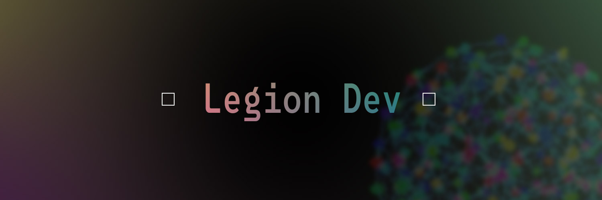

# Legion Project



## Overview
Legion is an experimental crypto-native project that visualizes a **living swarm of nodes** in 3D space.  
Each participant (client) spawns as a **metaball entity** in the network, dynamically connected through  
quantum-like links that ripple and transfer energy in real-time.

This project explores the intersection of **WebSockets, 3D graphics (Three.js / React Three Fiber)**,  
and **crypto-inspired lore**, bringing decentralized presence to life in a cosmic digital canvas.

---

## Features
- 🌐 **Dynamic Swarm Rendering** — Every connected client spawns a unique metaball.
- 🎨 **Unique Identity** — Each node has its own randomized color gradients.
- 🔗 **Quantum Links** — Smooth, wavy connections between nodes with animated nano-crawlers.
- 🛰 **Camera Controls** — Follow your node, free-fly, reset, or zoom out to view the full swarm.
- ⚡ **WebSocket Driven** — Real-time updates of client joins/leaves.
- 🌌 **Cosmic Aesthetic** — Stars, haze, and node interactions create a living galaxy.

---

## Tech Stack
- **Frontend**: Next.js, React Three Fiber, Drei
- **3D Graphics**: Three.js (custom shaders, metaballs, quantum links)
- **Realtime Backend**: Node.js, WebSocket Server
- **Styling**: CSS modules / Inline styling

---

## Getting Started

### Prerequisites
- Node.js (>= 18)
- npm or yarn

### Installation
```bash
# Clone the repository
git clone https://github.com/your-username/legion.git
cd legion

# Install dependencies
npm install

# Start the development server
npm run dev
```

---

## Project Structure
```
src/
  app/              # Next.js app routes
  components/       # UI + 3D components (Swarm, MetaBall, QuantumLinks, etc.)
  public/           # Static assets (banner, icons, etc.)
  scripts/          # Utility scripts
```

---

## Usage
- Open the app in your browser.
- A metaball spawns representing your session.
- Move the camera freely, or follow/reset/zoom out using UI controls.
- Open multiple tabs to simulate multiple clients and watch the swarm grow.

---

## License
This project is licensed under the MIT License.
